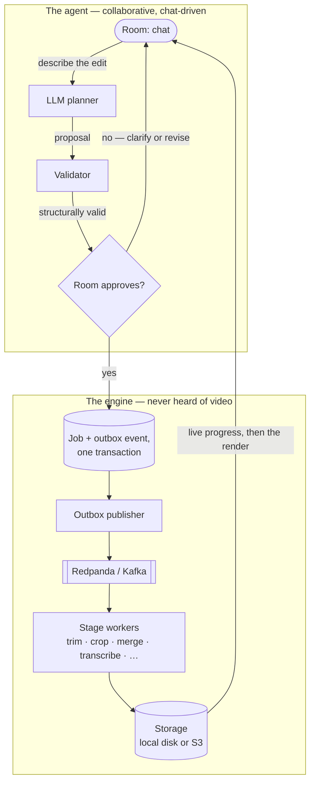

# VedAI

An AI agent for teams, not a tool for one person. You open a room, upload
footage, and describe the edit you want in chat — the agent turns that into a
concrete plan, the room reviews and approves it together, then it actually
executes. No timeline. No toolbar. No drag-and-drop. The only path to an edit
is chat → proposal → approval → job, on purpose — so nothing changes in the
video that everyone in the room didn't see and agree to first.

This repo (**Setu**) is the backend: the event-driven engine underneath the
agent. Two layers live in it, and keeping them ignorant of each other is the
point:

- **The engine** — jobs dispatched through a queue with idempotency guarantees,
  exponential-backoff retries, dead-letter handling and crash recovery. It has
  never heard of video; it moves opaque payloads between stages and guarantees
  they arrive.
- **The agent** — collaborative rooms where you describe an edit in chat, an
  LLM planner turns it into a validated workflow, the room votes, and the
  engine executes it. Every edit is just a multi-stage job.

Adding a new editing capability is a worker class, a registry entry and one line
in a map — no orchestration code changes.

Frontend lives in a separate repo:
[vedai-studio](https://github.com/AdarshG2028/vedai-studio).

## Architecture



## Requirements

- Python 3.13 and [uv](https://docs.astral.sh/uv/)
- Docker (for Postgres and the Kafka-compatible broker only)
- [ffmpeg](https://ffmpeg.org/download.html) (both `ffmpeg` and `ffprobe` on
  PATH) — required by `video_analysis` and by every media capability, which shell
  out to it directly rather than through a Python wrapper. Not needed to run the
  API itself, and tests that shell out skip cleanly when it's absent.
- A [Groq](https://console.groq.com/) API key for the real planner and for
  transcription. Without one the API still boots and the conversation loop still
  works — it falls back to a deterministic `StaticPlanner` — but it won't plan
  from natural language.

Python runs on the host via uv; Docker is used for backing services.

## Getting started

```bash
uv sync
cp .env.example .env          # then set GROQ_API_KEY

# Postgres + Redpanda + Console + Prometheus + Grafana + Jaeger + Adminer
docker compose -f docker/docker-compose.yml up -d

uv run alembic upgrade head
uv run uvicorn backend.api.main:app --reload
```

Workers are separate processes, one per topic. Start at least the analysis
worker, or uploads never leave `analyzing`:

```bash
uv run python -m backend.workers.cli video_analysis --worker video_analysis
uv run python -m backend.workers.cli crop --worker crop --metrics-port 9101
```

Each worker exposes its own metrics registry, so a second worker on the same host
needs a different `--metrics-port`. Running the full set means 16 processes — the
15 editing capabilities plus `video_analysis`. A workflow that reaches a stage
with no worker consuming its topic doesn't error; the job simply never
progresses.

### Walking through an edit

Identity is an asserted `X-User-Id` header — there is no users table and no
login (see `backend/api/deps.py`). Any UUID identifies a user.

```bash
U=$(python -c "import uuid;print(uuid.uuid4())")

# Create a room
P=$(curl -s -X POST localhost:8000/projects -H "X-User-Id: $U" \
     -H 'Content-Type: application/json' -d '{}' | jq -r .id)

# Upload footage into it (submits Job #1: workflow ["video_analysis"])
curl -s -X POST localhost:8000/projects/$P/videos -H "X-User-Id: $U" \
     -F "file=@clip.mp4" | jq

# Describe the edit; the planner replies with a question or a proposal
curl -s -X POST localhost:8000/projects/$P/messages -H "X-User-Id: $U" \
     -H 'Content-Type: application/json' \
     -d '{"content":"trim the first 5 seconds and normalise the audio"}' | jq

# Approve it — once the room's policy is satisfied, the job is submitted
curl -s -X POST localhost:8000/proposals/<proposal_id>/approve -H "X-User-Id: $U" | jq
```

Full interactive API docs at `/docs`.

## Capabilities

Fifteen, each an independent worker: `trim`, `remove_segment`, `merge`, `crop`,
`resize`, `rotate`, `flip`, `pad`, `color`, `audio`, `transcribe`,
`burn_subtitles`, `detect_scenes`, `detect_filler_words`, `render`.

Stages produce **typed assets**, not "a video" — `transcribe` emits a transcript
and a subtitle file and passes the video through untouched. Each stage forwards
everything it received and replaces only what it regenerated, so a consuming
stage never has to sit adjacent to its producer.

## Tests

```bash
uv run pytest
```

726 tests. Those needing Postgres or Kafka skip automatically when the stack is
down.

## Running it in Docker

One image serves every role; the command selects which:

```bash
docker compose -f docker/docker-compose.prod.yml up -d --build
docker compose -f docker/docker-compose.prod.yml run --rm api migrate
```

Requires `POSTGRES_PASSWORD`, `GROQ_API_KEY` and `CORS_ALLOWED_ORIGINS` in the
environment — compose fails fast rather than booting misconfigured. The API binds
to loopback only, on the assumption TLS terminates at a reverse proxy in front of
it.

Migrations are a deliberate separate step rather than something every container
runs at boot. Sizing note: 16 worker containers plus Postgres and Redpanda want
more than 4 GB — see the comments at the top of the compose file.

## Layout

```
backend/
├── api/            FastAPI routers, schemas, dependencies (identity guards)
├── core/           settings and application config
├── database/       engine, session, Alembic migrations
├── models/         SQLAlchemy ORM models
├── repositories/   data access
├── services/       business logic — planner, validator, workflow compiler,
│                   proposals, approval policies, room snapshot and events
├── workers/        one class per capability, plus the shared ffmpeg helpers
├── workflow/       the engine that dispatches stages and advances jobs
├── storage/        media storage behind an interface (local disk or S3)
├── messaging/      Kafka producer/consumer and the outbox publisher
└── observability/  logging, tracing, metrics
```

## Design notes

- **The outbox pattern.** A job row and its event are written in one transaction;
  a publisher drains the outbox to Kafka. There's no window where a job exists
  but its event was lost.
- **The LLM plans, it never executes.** Between the planner and anything that
  touches a file sit a deterministic validator and a human vote. Invalid
  proposals regenerate exactly once with the errors fed back, then give up with a
  clarifying question rather than looping.
- **Structural constraints are data, not prose.** A rule the planner must obey
  (`merge` can only run first) is a field on the capability that the validator
  enforces, not a sentence in a prompt.
- **Storage URIs are opaque.** Nothing outside `backend/storage/` parses or
  constructs one, which is why adding S3 was purely additive.
